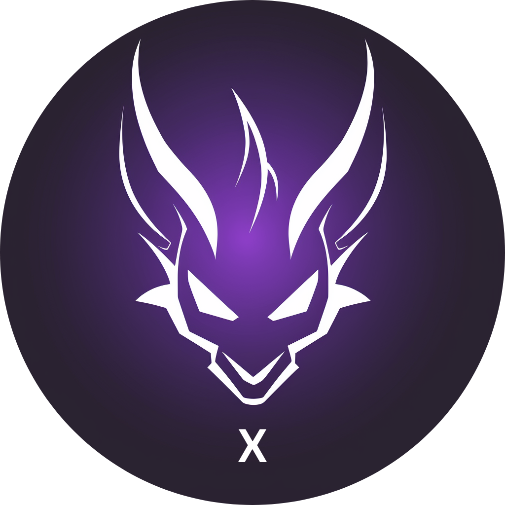

  <h1>Beerus X</h1>
    
   
   
  <a href="https://github.com/keep-starknet-strange/beerus-x/issues/new?assignees=&labels=bug&template=01_BUG_REPORT.md&title=bug%3A+">Report a Bug</a>
  -
  <a href="https://github.com/keep-starknet-strange/beerus-x/issues/new?assignees=&labels=enhancement&template=02_FEATURE_REQUEST.md&title=feat%3A+">Request a Feature</a>

 

## Overview
A Beerus Light Client Chrome Extension.

## Setup

- navigate to `chrome://extensions`
- enable developer mode
- click `load unpacked` -> select root dir
